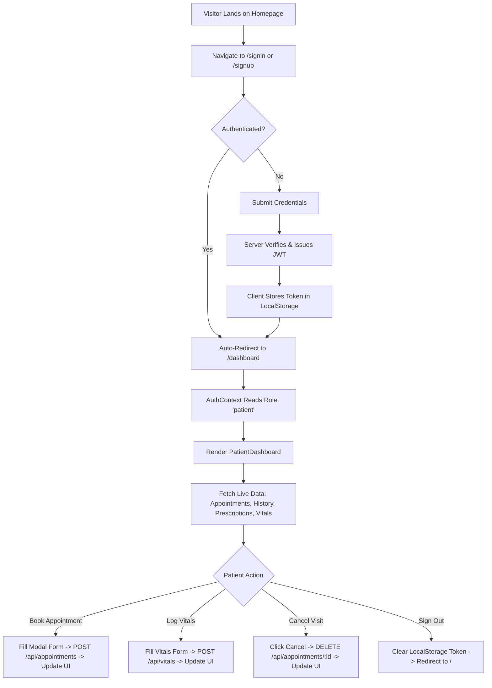
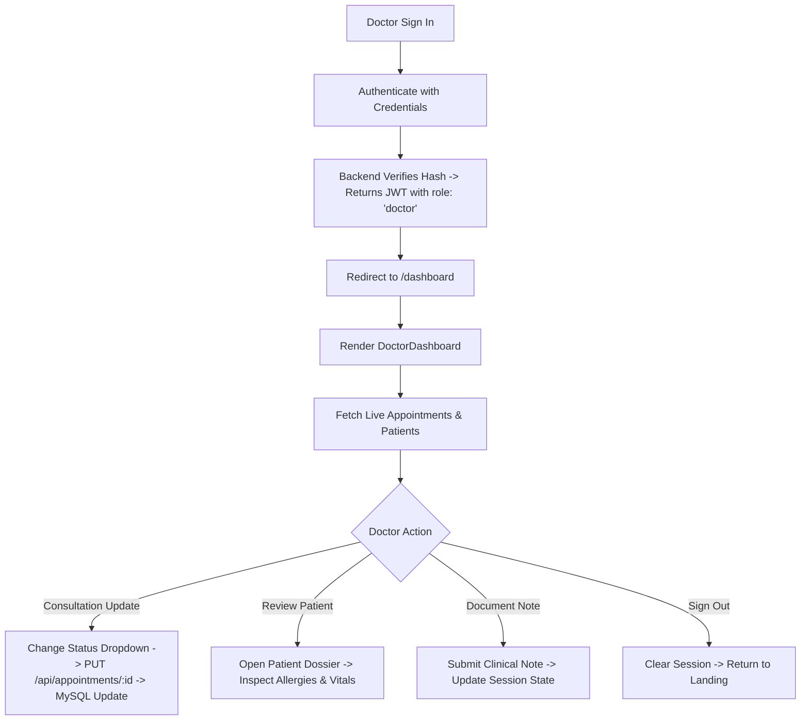
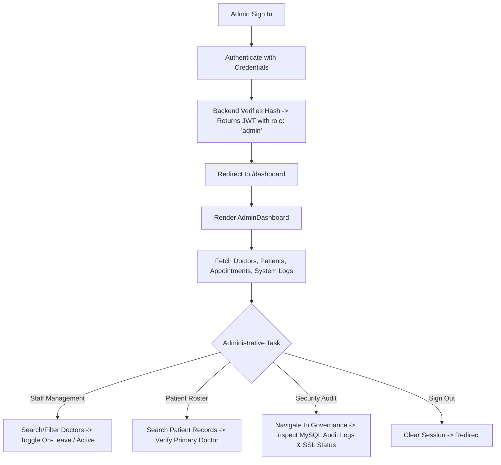

# Product Requirements Document (PRD) — DrumGate

## Document Metadata
- **Product Name**: DrumGate (鼓門)
- **Document Version**: 1.0.0
- **Implementation Status**: Fully Implemented (Core MVP & Themed Clinical Portals)
- **Target Audience**: Technical Interviewers, Project Evaluators, Engineering Teams, Stakeholders
- **Repository**: [DrumGate GitHub Repository](https://github.com/ShantanuGV/DrumGate.git)

---

## 1. Product Overview

### 1.1 What DrumGate Is
DrumGate is a full-stack, multi-portal healthcare management web application engineered with a distinctive Japanese aesthetic and Demon Slayer (*Kimetsu no Yaiba*) thematic framing. The platform unifies patients, medical doctors, and clinic administrators under a single, highly stylized interface that balances rigorous clinical utility with an engaging, serene user experience.

### 1.2 What Problem It Addresses
Traditional Electronic Health Record (EHR) and clinical management platforms are notoriously sterile, fragmented, and intimidating. Patients face convoluted portals to schedule visits and view vitals, physicians struggle with cluttered charting tools, and administrators lack unified visibility into medical staff and patient registries. DrumGate solves this by providing:
- Streamlined role-specific sanctuaries (Patient, Doctor, Admin).
- Frictionless appointment booking and lifecycle tracking.
- Immediate vitals logging and historical clinical records retrieval.
- Centralized administrative oversight and audit logging.

### 1.3 Product Objective
To provide a secure, responsive, full-stack healthcare platform where user roles are strictly authenticated, medical data is persistently managed in a relational MySQL database, and clinical operations—from vital sign updates to schedule management—occur seamlessly across modern web clients.

---

## 2. Problem Statement

Modern outpatient clinics and private medical practices face operational hurdles:
1. **Disjointed Portals**: Patients and physicians often operate on completely separate software with inconsistent data synchronization.
2. **Scheduling Inefficiencies**: Booking consultations, tracking appointment statuses (`confirmed`, `pending`, `in-progress`, `completed`), and handling cancellations create unnecessary administrative friction.
3. **Impersonal Patient Experience**: Clinical portals frequently neglect user interface craftsmanship, increasing anxiety for patients seeking care or managing chronic conditions.
4. **Administrative Opacity**: Clinic administrators lack quick, real-time dashboards to inspect staff allocations, room assignments, active caseloads, and security audit logs.

DrumGate addresses these challenges by merging an intuitive role-based architecture with persistent relational storage, responsive modern UI, and clear clinical workflows.

---

## 3. Target Users

DrumGate strictly implements and supports three authenticated user roles, verified directly from the application's database schema (`ENUM('patient', 'doctor', 'admin')`) and routing architecture:

| Role | System Representation | Primary Focus |
| :--- | :--- | :--- |
| **Patient** | `role: 'patient'` | Access personal health records, log current vitals, book clinic consultations, and review prescriptions. |
| **Doctor** | `role: 'doctor'` | Manage daily clinical schedules, track assigned patients, update consultation statuses, and document clinical notes. |
| **Admin** | `role: 'admin'` | Oversee platform governance, provision and monitor medical faculty, manage patient directories, and inspect audit logs. |

*Note: No other user roles (e.g., Nurse, Pharmacist, Billing Specialist) exist in the current implementation.*

---

## 4. User Capabilities

### 4.1 Patient

#### Implemented Capabilities:
- **Authentication**: Register with full name, email, password, and explicit role selection; sign in with automatic server-side role resolution; sign out with token invalidation.
- **Sanctuary Overview**: View personalized greeting (time-sensitive: morning/afternoon/evening), immediate vitals summary strip, next upcoming confirmed consultation, recent clinical history preview, and curated wellness guidelines.
- **Appointment Management**:
  - View all scheduled appointments with doctor name, specialty, date, time, clinic room, mode (`In-Clinic` or `Video Call`), and status badge.
  - Search appointments by doctor name or clinical specialty.
  - Filter appointments by status (`all`, `confirmed`, `pending`).
  - Book new appointments via modal form, selecting physician, date, time, clinic room, consultation mode, and notes (persisted directly to MySQL via `POST /api/appointments`).
  - Cancel existing appointments (persisted to MySQL via `DELETE /api/appointments/:id`).
- **Health Vitals Tracking**:
  - View current vital metrics: Blood Pressure (mmHg), Heart Rate (bpm), Blood Glucose (mg/dL), Body Weight (kg), and Blood Oxygen Level (% SpO2) along with last-updated timestamp.
  - Log new vital signs via modal form; values update both frontend state and MySQL backend (`POST /api/vitals`), automatically appending a log entry to clinical history.
- **Medical History & Reports**:
  - Inspect chronologically ordered clinical timeline entries (Consultations, Lab Results, Therapy Sessions, Vitals Logs).
  - Filter history records by category (`all`, `Consultation`, `Lab Results`, `Therapy Session`, `Prescription`).
  - View and launch printable/downloadable Clinical Health Summary modal with vital indicators and emergency contacts.
- **Prescriptions Review**:
  - Review active prescriptions with medication name, prescribed dosage, administration frequency, prescribing physician, remaining refills, and active status.
- **Profile & Health Baseline**:
  - Review demographic and clinical baseline details: Blood Group, documented Allergies, assigned Primary Care Physician, Emergency Contact, and Registration Date.

#### Relevant Screens & Modals:
- `/dashboard` (renders `PatientDashboard.tsx` with sections: `overview`, `appointments`, `history`, `prescriptions`, `profile`).
- Book Appointment Modal (`showBookModal`).
- Log Vitals Modal (`showVitalsModal`).
- Clinical Health Summary Report Modal.

---

### 4.2 Doctor

#### Implemented Capabilities:
- **Clinical Console Overview**:
  - View daily schedule overview, active patient count, pending consultations counter, and recent clinical notes summary.
- **Schedule & Consultation Management**:
  - Review appointments filtered by status (`all`, `upcoming`, `in-progress`, `completed`) or doctor search query.
  - Inspect patient name, scheduled time, consultation type, room assignment, delivery mode, and clinical notes.
  - Update appointment status dynamically via dropdown (`upcoming` ↔ `in-progress` ↔ `completed`), directly persisting updates to MySQL via `PUT /api/appointments/:id`.
  - Add new patient appointments to the schedule via modal form.
- **Patient Caseload Directory**:
  - Search and filter assigned patients by name or medical condition.
  - View patient cards with age, gender, phone number, blood type, known allergies, assigned condition, and last visit date.
  - Open detailed Patient Medical Dossier modal displaying demographic info, emergency indicators, and historical records.
- **Clinical Notes & Charting**:
  - View chronological consultation notes with diagnosis, treatment summary, prescribed medication, and follow-up timeline.
  - Add new clinical consultations and medical notes via dedicated form (updating active clinical session state).
- **Physician Profile**:
  - Inspect physician credentials, specialty department, assigned clinic suite/room, contact email, and active status.

#### Relevant Screens & Modals:
- `/dashboard` (renders `DoctorDashboard.tsx` with sections: `overview`, `appointments`, `patients`, `consultations`, `profile`).
- New Visit Scheduling Modal.
- Patient Medical Dossier Modal.

---

### 4.3 Admin

#### Implemented Capabilities:
- **Command Center Overview**:
  - Platform metric counters: Active Medical Doctors, Total Registered Patients, Total Consultations, System Health Status.
  - Quick action shortcuts to provision staff, register patients, and review system logs.
  - Recent operational log feed.
- **Medical Faculty Management**:
  - View complete doctors directory with name, department/specialty, email, direct phone, room assignment, active caseload count, and status badge (`active`, `on-leave`, `inactive`).
  - Filter doctors by status (`all`, `active`, `on-leave`, `inactive`) and search by name, specialty, or email.
  - Provision and credential new medical doctors via form (updates directory state; backend `POST /api/doctors` available).
  - Toggle doctor active status directly (`active` → `on-leave` → `inactive`).
  - Remove doctor records from the active view.
- **Patient Directory Management**:
  - View complete registered patient roster with registration date, assigned primary care physician, age, and contact number.
  - Search patients by name, email, or assigned physician.
  - Register new patients via credentialing form (updates directory state; backend `POST /api/patients` available).
- **Global Appointments Oversight**:
  - Inspect clinic-wide appointments across all doctors and patients.
  - Filter appointments by status (`all`, `confirmed`, `pending`) and search by patient or doctor name.
- **Platform Governance & Security**:
  - Review security posture: Database SSL/TLS encryption verification, JWT token expiration policies, RBAC enforcement status, and automated cloud backup indicators.
  - Live inspection of system audit logs fetched from MySQL `system_logs` table (`GET /api/logs`) detailing system actions, timestamps, and severity levels (`info`, `warning`, `error`).
- **Admin Profile**:
  - View administrator identity, assigned authority level, and active session details.

#### Relevant Screens & Modals:
- `/dashboard` (renders `AdminDashboard.tsx` with sections: `overview`, `doctors`, `patients`, `appointments`, `governance`, `profile`).
- Add Medical Doctor Modal Form.
- Add Patient Record Modal Form.

---

## 5. User Flows

### 5.1 Patient Primary Workflow

### 5.2 Doctor Primary Workflow

### 5.3 Admin Governance Workflow

---

## 6. Functional Requirements

| ID | Requirement Title | Description | Status |
| :--- | :--- | :--- | :--- |
| **FR-01** | User Registration | System shall allow users to register with full name, valid email format, minimum 8-character password, and role selection (`patient`, `doctor`, `admin`). Passwords must be hashed using bcrypt (12 rounds) before database storage. | **Implemented** |
| **FR-02** | User Authentication | System shall authenticate users via email and password, returning a signed JWT token containing user ID, email, full name, and database-persisted role. | **Implemented** |
| **FR-03** | Automatic Role Detection | System shall determine user role strictly from the database during sign-in without requiring the user to specify their role in the login form. | **Implemented** |
| **FR-04** | Session Verification | System shall verify existing JWT tokens on application load via `GET /api/auth/me` and restore the active user session. | **Implemented** |
| **FR-05** | Role-Based Dashboard Routing | System shall route authenticated users to their corresponding dashboard (`PatientDashboard`, `DoctorDashboard`, or `AdminDashboard`) based on their verified role. | **Implemented** |
| **FR-06** | Appointment Scheduling | System shall allow patients to schedule appointments with a doctor, date, time, clinic suite, and mode, persisting the record to MySQL (`POST /api/appointments`). | **Implemented** |
| **FR-07** | Appointment Status Modification | System shall allow doctors to update consultation statuses (`upcoming`, `in-progress`, `completed`), executing a dynamic SQL update (`PUT /api/appointments/:id`). | **Implemented** |
| **FR-08** | Appointment Cancellation | System shall allow patients to cancel scheduled appointments, deleting the record from MySQL (`DELETE /api/appointments/:id`). | **Implemented** |
| **FR-09** | Health Vitals Recording | System shall allow patients to log updated vitals (BP, HR, glucose, weight, SpO2) and persist them to MySQL (`POST /api/vitals`). | **Implemented** |
| **FR-10** | Vitals & History Retrieval | System shall retrieve recent vitals and medical history from MySQL to display on the patient portal (`GET /api/vitals`, `GET /api/history`). | **Implemented** |
| **FR-11** | Prescriptions Inspection | System shall retrieve active medication prescriptions and display dosage, frequency, prescribing physician, and refill counts (`GET /api/prescriptions`). | **Implemented** |
| **FR-12** | Doctors Directory & Caseloads | System shall provide a list of medical doctors with specialties, contact info, and active patient counts (`GET /api/doctors`). | **Implemented** |
| **FR-13** | Patients Registry | System shall provide a complete patient directory with condition details, age, contact information, and assigned physician (`GET /api/patients`). | **Implemented** |
| **FR-14** | Audit & System Logging | System shall log platform security and clinical sync events in MySQL (`system_logs`) and present them to administrators (`GET /api/logs`). | **Implemented** |
| **FR-15** | Quick-Fill Demo Credentials | System shall provide convenient demo login selectors for test accounts (Tanjiro, Dr. Shinobu, Kagaya) on the sign-in screen. | **Implemented** |
| **FR-16** | Frontend Search & Filtering | System shall support real-time client-side search and status filtering across appointments, doctors, and patient lists. | **Implemented** |

---

## 7. Non-Functional Requirements

### 7.1 Security
- **Verified Implementation**:
  - Cryptographic password hashing using bcrypt with 12 salt rounds.
  - JSON Web Tokens (JWT) signed with HMAC-SHA256 (`jsonwebtoken`) and configurable expiry (`7d` default).
  - Parameterized database queries utilizing `mysql2/promise` (`pool.execute`) to prevent SQL injection.
  - Database communication secured via TLS/SSL for cloud MySQL (Aiven).
  - Cross-Origin Resource Sharing (CORS) configured on Express server.
- **Design Goals / Requires Hardening**:
  - Secure HTTP-only cookies for JWT storage instead of browser `localStorage`.
  - Backend authentication and role verification middleware on `/api/*` data routes.

### 7.2 Performance
- **Verified Implementation**:
  - Vite 8.3 build system enabling sub-second Hot Module Replacement (HMR) and optimized production bundles.
  - MySQL connection pooling (`connectionLimit: 10`, `queueLimit: 0`, `enableKeepAlive: true`) preventing connection starvation.
  - Lightweight component rendering with zero large external UI component library overhead.

### 7.3 Responsiveness & Accessibility
- **Verified Implementation**:
  - Fully responsive grid and flexbox layouts utilizing Tailwind CSS v4.
  - Mobile slide-out drawer sidebar with touch-friendly backdrop overlay (`DashboardLayout.tsx`).
  - Fluid typography clamp functions (`clamp(1.8rem, 3vw, 2.4rem)`) and high-contrast color palettes adhering to WCAG contrast standards.

### 7.4 Maintainability & Extensibility
- **Verified Implementation**:
  - Strict TypeScript types across frontend components and interfaces.
  - Centralized authentication state management via React Context (`AuthContext.tsx`).
  - Cohesive design system tokens defined in `src/index.css` under Tailwind's `@theme` directive.

---

## 8. Scope

### 8.1 Current Scope (Fully Implemented)
- Complete Japanese/Demon Slayer-themed public marketing landing page (`Landing.tsx`, `Hero`, `Philosophy`, `Trust`, `Portals`, `ZenSection`, `HowItWorks`, `FinalCTA`, `Footer`).
- Full authentication cycle (`SignUp.tsx`, `SignIn.tsx`, `AuthContext.tsx`, `server/auth.js`) with bcrypt password hashing and JWT issuance.
- Three specialized dashboard views (`PatientDashboard.tsx`, `DoctorDashboard.tsx`, `AdminDashboard.tsx`) managed through `Dashboard.tsx` and `DashboardLayout.tsx`.
- MySQL schema initialization and automatic database seeding (`server/db.js`) covering 8 tables.
- REST API implementation across Express routes (`server/auth.js`, `server/data.js`, `server/index.js`, `api/index.js`).
- Dual runtime support: Standalone Node.js server (local dev) and Vercel Serverless Function wrapper (`api/index.js`).

### 8.2 Out of Scope (Intentionally Excluded)
- Real payment gateway integration (e.g., Stripe, Razorpay) for consultation billing.
- Real-time WebRTC audio/video streaming engine (consultations support `mode: 'Video Call'` as a clinical tag, but live video streaming server is not integrated).
- Real SMS / Telephony gateway (phone numbers are formatted and stored for records only).
- Live email transmission via SMTP / SendGrid (emails are stored and used as unique user identifiers).

### 8.3 Future Scope (Planned Improvements)
- Backend authorization middleware attached to all `/api/*` data routes.
- Foreign key constraints defined in the relational database DDL with cascading updates/deletes.
- Multi-factor authentication (MFA / TOTP) for physician and administrator access.
- In-app notification center for automated appointment reminders and prescription refill alerts.
- Granular patient-to-doctor data isolation policies enforced at the database query level.
