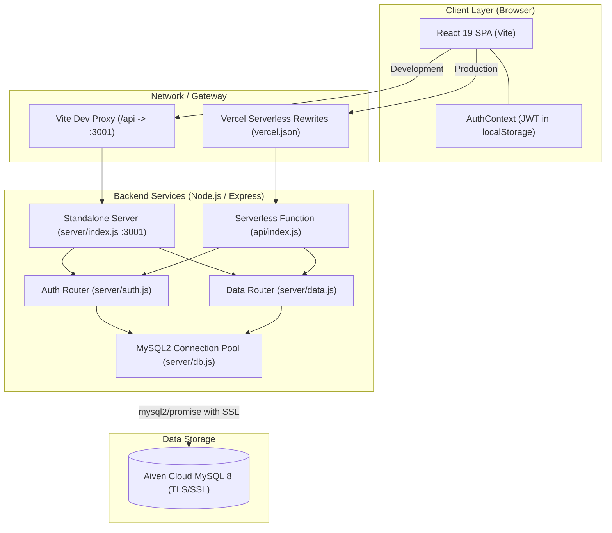
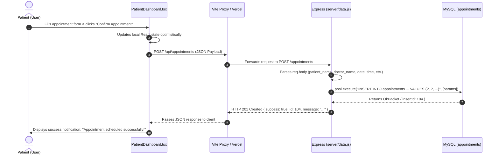

# System Architecture & Technical Documentation — DrumGate

## Document Metadata
- **Document Version**: 1.0.0
- **System**: DrumGate Full-Stack Healthcare Platform
- **Architecture Pattern**: Decoupled Client-Server / Serverless-Ready Monolith
- **Target Audience**: Software Architects, Technical Evaluators, Full-Stack Engineers

---

## 1. System Overview

DrumGate is structured as a modern decoupled full-stack web application. The frontend is a Single-Page Application (SPA) built with React 19, TypeScript, and Tailwind CSS v4, bundled via Vite. The backend is an Express application written in modern ES Modules (ESM) that can be run either as a standalone long-running Node.js process (for local development on port 3001) or as an edge/serverless function on Vercel (`api/index.js`). The persistent storage layer is a managed MySQL relational database (hosted on Aiven Cloud with TLS/SSL encryption or running locally).

### Architecture Diagram



---

## 2. Technology Stack

The following versions and technologies have been verified directly from the application's root `package.json` and `server/package.json`:

| Layer | Technology | Version | Purpose |
| :--- | :--- | :--- | :--- |
| **Frontend Framework** | React | `^19.3.0` | UI component tree, hooks, and reactive state management |
| **Frontend DOM** | React DOM | `^19.3.0` | DOM rendering engine for React 19 |
| **Routing** | React Router DOM | `^7.18.4` | Client-side declarative routing and protected route guards |
| **Build & Bundler** | Vite | `^8.3.0` | Next-generation frontend tooling and development server |
| **Language** | TypeScript | `~6.0.2` | Static type safety and developer productivity |
| **Styling** | Tailwind CSS | `^4.3.3` | Utility-first CSS engine with custom `@theme` configuration |
| **Vite Tailwind Plugin** | `@tailwindcss/vite` | `^4.3.3` | Native Vite integration for Tailwind CSS v4 engine |
| **Icons** | Lucide React | `^1.51.0` | Modern, consistent icon library for clinical and navigation UI |
| **Backend Runtime** | Node.js | `>= 18.x` | JavaScript runtime environment (ES Modules enabled) |
| **API Framework** | Express | `^4.21.2` / `^5.2.1` | RESTful API server routing, middleware, and request handling |
| **Database Driver** | `mysql2` | `^3.12.0` / `^3.24.5` | High-performance MySQL client supporting Promises & TLS |
| **Password Hashing** | `bcryptjs` / `bcrypt`| `^3.0.3` / `^5.1.1` | Cryptographic password hashing (12 salt rounds) |
| **Token Authentication**| `jsonwebtoken` | `^9.0.2` / `^9.0.3` | Creation and verification of signed HMAC-SHA256 JWT tokens |
| **CORS Middleware** | `cors` | `^2.8.5` / `^2.8.6` | Cross-Origin Resource Sharing configuration |
| **Environment Config** | `dotenv` | `^16.4.7` / `^18.0.5`| Loads environment variables from `.env` files |
| **Database Provider** | MySQL 8 (Aiven Cloud)| `8.x` | Cloud-hosted managed relational database with TLS/SSL |
| **Hosting Platform** | Vercel | V2 Config | Production static hosting and serverless function deployment |

---

## 3. Frontend Architecture

### 3.1 Entry Point & Bootstrapping
- **File**: `src/main.tsx`
- **Execution**: Mounts the root React component tree into `div#root` inside `index.html` using `createRoot(document.getElementById('root')!)`.
- **Global Styles**: Imports `src/index.css` which initializes the Japanese-inspired dark fantasy aesthetic tokens under `@theme`.

### 3.2 Routing & Route Protection
- **File**: `src/App.tsx`
- Utilizes React Router DOM v7 (`BrowserRouter`, `Routes`, `Route`, `Navigate`).
- **Route Definitions**:
  - `/` → `Landing.tsx` (Public marketing landing page).
  - `/signin` → Wrapped in `<AuthRoute>`, renders `SignIn.tsx`. If user is already authenticated, redirects automatically to `/dashboard`.
  - `/signup` → Wrapped in `<AuthRoute>`, renders `SignUp.tsx`. If user is already authenticated, redirects automatically to `/dashboard`.
  - `/dashboard` → Wrapped in `<ProtectedRoute>`, renders `Dashboard.tsx`. If no active session, redirects to `/signin`.

### 3.3 State Management & Authentication Context
- **File**: `src/context/AuthContext.tsx`
- Exposes `AuthContext` consumed via the custom hook `useAuth()`.
- **State Managed**:
  - `user`: `{ id: number, full_name: string, email: string, role: 'patient' | 'doctor' | 'admin' } | null`.
  - `token`: `string | null` (synchronized with `localStorage.getItem('drumgate_token')`).
  - `loading`: `boolean` (initial token verification state).
- **Core Methods**:
  - `signIn(email, password)`: POSTs to `/api/auth/signin`, saves token in `localStorage`, updates state.
  - `signUp(signUpData)`: POSTs to `/api/auth/signup`, saves token in `localStorage`, updates state.
  - `signOut()`: Clears `localStorage` and resets state to `null`.
- **On Mount**: Dispatches `GET /api/auth/me` with `Authorization: Bearer <token>`. If the token is invalid or expired, clears storage and resets session.

### 3.4 Role Dashboard Resolution
- **File**: `src/pages/Dashboard.tsx`
- Acts as a dynamic role-based dispatcher based on `user.role` retrieved from the database:
  - `role === 'patient'` → `<PatientDashboard />`
  - `role === 'doctor'` → `<DoctorDashboard />`
  - `role === 'admin'` → `<AdminDashboard />`
  - Fallback → `<PatientDashboard />`

### 3.5 Reusable Components
- `DashboardLayout.tsx`: Common shell for all three portals featuring:
  - Collapsible desktop/mobile sidebar with active navigation indicators.
  - Brand header with Kanji emblem (`鼓`).
  - User session card with initial avatar and sign-out button.
  - Ambient banner header with themed Japanese cover photography, quotes, and badges.
- Landing Page Modular Components:
  - `Navbar.tsx`: Sticky navigation with blur backdrop and portal entry links.
  - `Hero.tsx`: High-impact typography with torii gate backdrop.
  - `Philosophy.tsx`: Four pillars of DrumGate care philosophy.
  - `Trust.tsx`: Key clinical reliability metrics.
  - `Portals.tsx`: Interactive preview of the Patient, Doctor, and Admin experiences.
  - `ZenSection.tsx`: Atmospheric break detailing tranquil healthcare design.
  - `HowItWorks.tsx`: 3-step patient journey breakdown.
  - `FinalCTA.tsx`: Conversion banner directing users to register.
  - `Footer.tsx`: Institutional footer with branding and copyright.

---

## 4. Backend Architecture

### 4.1 Server Entry Points

DrumGate supports dual runtime environments through two distinct entry files:
1. **Local Development Server (`server/index.js`)**:
   - Initialized via `node --watch index.js`.
   - Listens on `PORT` (default `3001`).
   - Configures CORS strictly for `http://localhost:5173` with `credentials: true`.
   - Attaches routes: `/api/auth` → `auth.js`, `/api` → `data.js`, `/api/health` → Health status.
2. **Serverless Production Entry Point (`api/index.js`)**:
   - Designed for Vercel Serverless Function execution.
   - Configures CORS dynamically (`origin: true`, `credentials: true`).
   - Supports dual mount paths (`/api/auth` and `/auth`; `/api` and `/`) to handle routing rewrites without breaking paths.
   - Exports the Express application instance as the default module (`export default app`).

### 4.2 Route Organization & Controllers
The backend adopts a consolidated controller-in-router pattern:
- **`server/auth.js`**: Contains authentication handlers:
  - `POST /signup`
  - `POST /signin`
  - `GET /me`
- **`server/data.js`**: Contains clinical and management domain handlers:
  - Doctors: `GET /doctors`, `POST /doctors`
  - Patients: `GET /patients`, `POST /patients`
  - Appointments: `GET /appointments`, `POST /appointments`, `PUT /appointments/:id`, `DELETE /appointments/:id`
  - Medical History: `GET /history`, `POST /history`
  - Prescriptions: `GET /prescriptions`, `POST /prescriptions`
  - Vitals: `GET /vitals`, `POST /vitals`
  - Logs: `GET /logs`, `POST /logs`

### 4.3 Database Connection Pool & Auto-Initialization
- **File**: `server/db.js`
- Uses `mysql2/promise` to create a managed connection pool:
  ```javascript
  const pool = mysql.createPool({
    host: process.env.DB_HOST,
    user: process.env.DB_USER,
    password: process.env.DB_PASSWORD,
    database: process.env.DB_NAME,
    port: parseInt(process.env.DB_PORT || '3306'),
    ssl: isSSL ? { rejectUnauthorized: false } : undefined,
    waitForConnections: true,
    connectionLimit: 10,
    queueLimit: 0,
    enableKeepAlive: true,
    keepAliveInitialDelay: 10000,
  });
  ```
- **Self-Bootstrapping `initDB()`**: On startup, tests connection, issues `CREATE TABLE IF NOT EXISTS` for all 8 application tables, and seeds initial Demon Slayer clinical master data if tables are empty.

---

## 5. Request Flow

To illustrate the complete request lifecycle, here is the end-to-end flow for **Scheduling a Patient Appointment**:



---

## 6. Authentication Architecture

DrumGate implements token-based authentication using JSON Web Tokens (JWT) combined with bcrypt password hashing:

```mermaid
flowchart TD
    subgraph ClientAuth ["Client State"]
        Credentials["User enters Email & Password"]
        LocalStorage[("localStorage: drumgate_token")]
        State["React AuthContext (user, token)"]
    end

    subgraph ServerAuth ["Server-Side Logic"]
        FindUser["Query: SELECT * FROM users WHERE email = ?"]
        BcryptCheck["bcrypt.compare(password, user.password_hash)"]
        SignJWT["jwt.sign({ id, email, role, full_name }, JWT_SECRET, { expiresIn: '7d' })"]
        VerifyJWT["jwt.verify(token, JWT_SECRET)"]
    end

    Credentials -->|POST /api/auth/signin| FindUser
    FindUser -->|Found| BcryptCheck
    BcryptCheck -->|Match| SignJWT
    SignJWT -->|Returns token & user| LocalStorage
    LocalStorage --> State
    State -->|GET /api/auth/me (Authorization: Bearer)| VerifyJWT
    VerifyJWT -->|Valid| State
```

1. **Registration**: Validates inputs, hashes password using `bcrypt.hash(password, 12)`, inserts user record into `users` table, and signs JWT.
2. **Sign In**: Queries user by email, verifies hash using `bcrypt.compare()`. User role is fetched strictly from the database, eliminating role spoofing on login. Signs and returns a 7-day JWT token.
3. **Session Verification**: `GET /api/auth/me` extracts the token from the `Authorization: Bearer <token>` header, verifies the signature, and retrieves the latest user record from the database.

---

## 7. Authorization Architecture

### 7.1 Verified Implementation
- **Frontend Protected Routes**: `<ProtectedRoute>` in `src/App.tsx` blocks unauthenticated users from reaching `/dashboard`.
- **Role Routing**: `Dashboard.tsx` checks `user.role` from the authenticated JWT session and displays only the authorized interface (`PatientDashboard`, `DoctorDashboard`, or `AdminDashboard`).
- **Token Verification Route**: `GET /api/auth/me` requires a valid Bearer token; requests without a token receive HTTP 401.

### 7.2 Architectural Observations & Missing Enforcements
- **Backend Data Routes**: In the current implementation of `server/data.js`, routes (`/api/appointments`, `/api/patients`, `/api/doctors`, etc.) do **NOT** inspect the `Authorization` header or verify JWT claims.
- **Resource Ownership**: Endpoints such as `DELETE /api/appointments/:id` or `GET /api/prescriptions` accept query parameters or route IDs without cross-checking the requester's identity or role.
- *Status*: **Partially implemented** (Frontend role segregation is complete; backend API middleware enforcement is a recommended improvement).

---

## 8. Error Handling

- **Backend Express Error Handling**:
  - Handlers encapsulate database operations in `try/catch` blocks.
  - Client errors (e.g., missing fields, duplicate email) return HTTP 400 or 409:
    ```json
    { "success": false, "message": "An account with this email already exists." }
    ```
  - Unhandled exceptions log the error to `console.error` and return HTTP 500:
    ```json
    { "success": false, "message": "Something went wrong. Please try again." }
    ```
- **Frontend Error Resilience**:
  - `AuthContext.tsx` handles network failures gracefully by returning `{ success: false, message: 'Network error...' }`.
  - Dashboard background sync operations (e.g., initial data fetches) use `.catch((err) => console.log('Sync note:', err))` to ensure a backend unavailability does not crash the client UI (falling back to initial seed data).

---

## 9. Environment Configuration

The application requires specific environment variables. These variables are managed via `.env` in local development and Vercel Environment Variables in production.

### Required Server Environment Variables (Template)
```env
# Database Configuration
DB_HOST=your-mysql-host.aivencloud.com
DB_USER=avnadmin
DB_PASSWORD=your_secure_password
DB_NAME=defaultdb
DB_PORT=12991
DB_SSL=true

# Authentication Configuration
JWT_SECRET=your_super_secret_jwt_key_at_least_32_chars
JWT_EXPIRES_IN=7d

# Server Configuration
PORT=3001
```

*Note: Frontend environment variables are not required because all API requests are routed through relative paths (`/api/*`), proxied locally by Vite and in production by Vercel.*

---

## 10. Deployment Architecture

### Current Verified Deployment Setup
- **Frontend & Serverless API**: Hosted on **Vercel**.
  - `vercel.json` rewrites `/api/(.*)` to `/api/index.js` and all other paths to `/index.html`.
- **Database**: Hosted on **Aiven Cloud MySQL** with SSL encryption enabled.
- **Custom Domain Target**: `drumgate.rakeshbhai.me` (DNS mapped to Vercel).
- **Build Output**: `dist` (generated via `tsc && vite build`).
