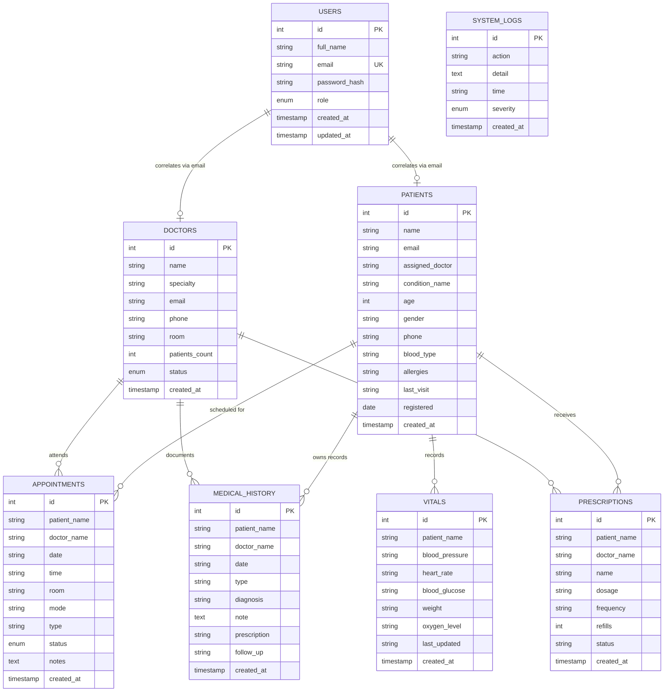

# Database & ERD Documentation — DrumGate

## Document Metadata
- **Document Version**: 1.0.0
- **Database Engine**: MySQL 8.0+
- **Storage Engine**: InnoDB
- **Character Set**: `utf8mb4`
- **Collation**: `utf8mb4_unicode_ci`
- **Driver**: `mysql2/promise` (Node.js)

---

## 1. Database Overview

DrumGate utilizes a managed relational MySQL database (deployed on Aiven Cloud with mandatory TLS/SSL encryption or accessible locally). The database layer is designed to support multi-role clinical operations, housing patient records, physician credentials, appointment schedules, vital signs, prescriptions, consultation notes, and security audit logs.

The database initialization logic is self-bootstrapping and located in `server/db.js`. Upon server startup, the function `initDB()` runs `CREATE TABLE IF NOT EXISTS` DDL statements for all 8 application tables, followed by automated initial seed data insertion if records do not already exist.

---

## 2. Application Tables Summary

The following 8 tables constitute the complete database schema of the DrumGate platform:

| Table | Purpose | Primary Key | Total Columns |
| :--- | :--- | :--- | :--- |
| **`users`** | Core authentication accounts, role assignments, and password hashes | `id` (AUTO_INCREMENT) | 7 |
| **`doctors`** | Medical faculty directory, specialties, clinic room assignments, and statuses | `id` (AUTO_INCREMENT) | 9 |
| **`patients`** | Registered patients directory, conditions, age, gender, and clinical baselines | `id` (AUTO_INCREMENT) | 13 |
| **`appointments`** | Scheduled clinical consultations, rooms, modes, statuses, and clinical notes | `id` (AUTO_INCREMENT) | 11 |
| **`medical_history`** | Chronological patient consultation notes, diagnoses, and follow-up plans | `id` (AUTO_INCREMENT) | 10 |
| **`prescriptions`** | Active patient medication orders, dosages, refill counts, and statuses | `id` (AUTO_INCREMENT) | 9 |
| **`vitals`** | Physiological biometric readings (blood pressure, heart rate, glucose, weight, SpO2) | `id` (AUTO_INCREMENT) | 9 |
| **`system_logs`** | Platform governance, clinical audit trails, and system synchronization events | `id` (AUTO_INCREMENT) | 6 |

---

## 3. Detailed Table Structures

### 3.1 Table: `users`
Stores user credentials and role classifications.

| Column | Type | Nullable | Key | Default | Description |
| :--- | :--- | :--- | :--- | :--- | :--- |
| `id` | `INT` | `NO` | `PRI` | `AUTO_INCREMENT` | Unique identifier for user account |
| `full_name` | `VARCHAR(100)` | `NO` | | | Full legal name of user |
| `email` | `VARCHAR(150)` | `NO` | `UNI` | | Unique login email address |
| `password_hash` | `VARCHAR(255)` | `NO` | | | Bcrypt password hash (12 salt rounds) |
| `role` | `ENUM('patient', 'doctor', 'admin')` | `NO` | | `'patient'` | Assigned platform authorization role |
| `created_at` | `TIMESTAMP` | `YES` | | `CURRENT_TIMESTAMP` | Account creation timestamp |
| `updated_at` | `TIMESTAMP` | `YES` | | `CURRENT_TIMESTAMP ON UPDATE CURRENT_TIMESTAMP` | Last profile update timestamp |

---

### 3.2 Table: `doctors`
Stores credentials, room allocations, and caseloads for physicians.

| Column | Type | Nullable | Key | Default | Description |
| :--- | :--- | :--- | :--- | :--- | :--- |
| `id` | `INT` | `NO` | `PRI` | `AUTO_INCREMENT` | Unique doctor record identifier |
| `name` | `VARCHAR(100)` | `NO` | | | Full name and title of physician |
| `specialty` | `VARCHAR(150)` | `NO` | | | Medical specialization / department |
| `email` | `VARCHAR(150)` | `NO` | | | Institutional contact email |
| `phone` | `VARCHAR(50)` | `NO` | | | Direct clinic contact number |
| `room` | `VARCHAR(50)` | `NO` | | | Assigned clinic suite or ward |
| `patients_count`| `INT` | `YES` | | `0` | Active patient caseload count |
| `status` | `ENUM('active', 'on-leave', 'inactive')`| `YES` | | `'active'` | Current clinical operational status |
| `created_at` | `TIMESTAMP` | `YES` | | `CURRENT_TIMESTAMP` | Record registration timestamp |

---

### 3.3 Table: `patients`
Stores demographic, physiological baseline, and primary care assignments for patients.

| Column | Type | Nullable | Key | Default | Description |
| :--- | :--- | :--- | :--- | :--- | :--- |
| `id` | `INT` | `NO` | `PRI` | `AUTO_INCREMENT` | Unique patient record identifier |
| `name` | `VARCHAR(100)` | `NO` | | | Full name of patient |
| `email` | `VARCHAR(150)` | `NO` | | | Patient contact email address |
| `assigned_doctor`| `VARCHAR(100)` | `NO` | | | Primary care doctor name |
| `condition_name`| `VARCHAR(150)` | `NO` | | | Primary diagnosis or health focus |
| `age` | `INT` | `NO` | | | Patient age in years |
| `gender` | `VARCHAR(20)` | `NO` | | | Gender identification |
| `phone` | `VARCHAR(50)` | `NO` | | | Contact telephone number |
| `blood_type` | `VARCHAR(10)` | `NO` | | | ABO/Rh blood group (e.g. A+, O+) |
| `allergies` | `VARCHAR(255)` | `YES` | | `'None'` | Documented clinical allergies |
| `last_visit` | `VARCHAR(50)` | `YES` | | `'Today'` | Descriptive last visit indicator |
| `registered` | `DATE` | `YES` | | `(CURRENT_DATE)` | Date patient joined the clinic |
| `created_at` | `TIMESTAMP` | `YES` | | `CURRENT_TIMESTAMP` | Record creation timestamp |

---

### 3.4 Table: `appointments`
Tracks outpatient visits, delivery modes, and consultation progress.

| Column | Type | Nullable | Key | Default | Description |
| :--- | :--- | :--- | :--- | :--- | :--- |
| `id` | `INT` | `NO` | `PRI` | `AUTO_INCREMENT` | Unique appointment record identifier |
| `patient_name` | `VARCHAR(100)` | `NO` | | | Name of scheduled patient |
| `doctor_name` | `VARCHAR(100)` | `NO` | | | Name of attending physician |
| `date` | `VARCHAR(50)` | `NO` | | | Appointment date (YYYY-MM-DD) |
| `time` | `VARCHAR(50)` | `NO` | | | Scheduled consultation time |
| `room` | `VARCHAR(50)` | `NO` | | | Clinic suite or examination ward |
| `mode` | `VARCHAR(50)` | `YES` | | `'In-Clinic'` | Delivery format (`In-Clinic` / `Video Call`) |
| `type` | `VARCHAR(100)` | `YES` | | `'Clinical Consultation'` | Clinical visit classification |
| `status` | `ENUM('confirmed', 'pending', 'completed', 'in-progress', 'upcoming')` | `YES` | | `'confirmed'` | Appointment lifecycle status |
| `notes` | `TEXT` | `YES` | | `NULL` | Pre-visit clinical or patient notes |
| `created_at` | `TIMESTAMP` | `YES` | | `CURRENT_TIMESTAMP` | Appointment creation timestamp |

---

### 3.5 Table: `medical_history`
Chronological clinical notes and diagnostic records.

| Column | Type | Nullable | Key | Default | Description |
| :--- | :--- | :--- | :--- | :--- | :--- |
| `id` | `INT` | `NO` | `PRI` | `AUTO_INCREMENT` | Unique history record identifier |
| `patient_name` | `VARCHAR(100)` | `NO` | | | Associated patient name |
| `doctor_name` | `VARCHAR(100)` | `NO` | | | Attending physician name |
| `date` | `VARCHAR(50)` | `NO` | | | Date of clinical encounter |
| `type` | `VARCHAR(100)` | `NO` | | | Event type (Consultation, Lab, Therapy, etc.) |
| `diagnosis` | `VARCHAR(150)` | `YES` | | `NULL` | Formal diagnostic summary |
| `note` | `TEXT` | `NO` | | | Comprehensive clinical progress note |
| `prescription` | `VARCHAR(255)` | `YES` | | `NULL` | Associated medication prescribed |
| `follow_up` | `VARCHAR(100)` | `YES` | | `NULL` | Recommended follow-up timeline |
| `created_at` | `TIMESTAMP` | `YES` | | `CURRENT_TIMESTAMP` | Record timestamp |

---

### 3.6 Table: `prescriptions`
Tracks pharmaceutical orders and refills.

| Column | Type | Nullable | Key | Default | Description |
| :--- | :--- | :--- | :--- | :--- | :--- |
| `id` | `INT` | `NO` | `PRI` | `AUTO_INCREMENT` | Unique prescription identifier |
| `patient_name` | `VARCHAR(100)` | `NO` | | | Associated patient name |
| `doctor_name` | `VARCHAR(100)` | `NO` | | | Prescribing physician name |
| `name` | `VARCHAR(100)` | `NO` | | | Pharmaceutical name |
| `dosage` | `VARCHAR(100)` | `NO` | | | Dosage amount (e.g. 20ml, 10mg) |
| `frequency` | `VARCHAR(150)` | `NO` | | | Administration timing and frequency |
| `refills` | `INT` | `YES` | | `1` | Authorized refill count |
| `status` | `VARCHAR(50)` | `YES` | | `'Active'` | Prescription status (e.g. Active, Completed) |
| `created_at` | `TIMESTAMP` | `YES` | | `CURRENT_TIMESTAMP` | Prescription creation timestamp |

---

### 3.7 Table: `vitals`
Captures point-in-time physiological health metrics.

| Column | Type | Nullable | Key | Default | Description |
| :--- | :--- | :--- | :--- | :--- | :--- |
| `id` | `INT` | `NO` | `PRI` | `AUTO_INCREMENT` | Unique vitals record identifier |
| `patient_name` | `VARCHAR(100)` | `NO` | | | Associated patient name |
| `blood_pressure`| `VARCHAR(50)` | `NO` | | | Blood pressure reading (systolic/diastolic) |
| `heart_rate` | `VARCHAR(50)` | `NO` | | | Resting heart rate in bpm |
| `blood_glucose` | `VARCHAR(50)` | `NO` | | | Blood glucose level in mg/dL |
| `weight` | `VARCHAR(50)` | `NO` | | | Body weight in kilograms |
| `oxygen_level` | `VARCHAR(50)` | `NO` | | | Blood oxygen saturation (% SpO2) |
| `last_updated` | `VARCHAR(100)` | `NO` | | | Human-readable timestamp string |
| `created_at` | `TIMESTAMP` | `YES` | | `CURRENT_TIMESTAMP` | Record timestamp |

---

### 3.8 Table: `system_logs`
Stores audit trails and administrative event records.

| Column | Type | Nullable | Key | Default | Description |
| :--- | :--- | :--- | :--- | :--- | :--- |
| `id` | `INT` | `NO` | `PRI` | `AUTO_INCREMENT` | Unique log entry identifier |
| `action` | `VARCHAR(150)` | `NO` | | | High-level system or clinical action |
| `detail` | `TEXT` | `NO` | | | Detailed description of event |
| `time` | `VARCHAR(50)` | `NO` | | | Display timestamp |
| `severity` | `ENUM('info', 'warning', 'error')` | `YES` | | `'info'` | Event severity classification |
| `created_at` | `TIMESTAMP` | `YES` | | `CURRENT_TIMESTAMP` | Log insertion timestamp |

---

## 4. Entity Relationships & Implementation Realities

### 4.1 Relationship Verification in Code
In the actual `server/db.js` DDL statements, **explicit `FOREIGN KEY` constraints are NOT declared**. 
Tables are logically associated through string-based identifiers:
- `appointments.patient_name` logically correlates with `patients.name`.
- `appointments.doctor_name` logically correlates with `doctors.name`.
- `medical_history.patient_name` logically correlates with `patients.name`.
- `prescriptions.patient_name` logically correlates with `patients.name`.
- `vitals.patient_name` logically correlates with `patients.name`.
- `users.email` matches `patients.email` or `doctors.email`.

### 4.2 Entity-Relationship (ER) Diagram

The following Mermaid diagram visualizes the **logical entity relationships** operating across the DrumGate schema:



---

## 5. Constraints & Indexes

The following constraints are explicitly enforced at the database level:
- **Primary Keys**: Every table defines `id INT NOT NULL AUTO_INCREMENT PRIMARY KEY`.
- **Unique Constraints**: `users` enforces `UNIQUE KEY email (email)`.
- **ENUM Restrictions**:
  - `users.role`: `'patient'`, `'doctor'`, `'admin'`.
  - `doctors.status`: `'active'`, `'on-leave'`, `'inactive'`.
  - `appointments.status`: `'confirmed'`, `'pending'`, `'completed'`, `'in-progress'`, `'upcoming'`.
  - `system_logs.severity`: `'info'`, `'warning'`, `'error'`.
- **Character Encoding**: Tables use `utf8mb4` with collation `utf8mb4_unicode_ci` on `InnoDB`, ensuring full Unicode support (including Japanese characters and emoji).

---

## 6. Data Integrity Analysis

### Current Implementation
- **Parameterized Execution**: SQL execution in `server/auth.js` and `server/data.js` uses `pool.execute(sql, [params])`, protecting query structure and parameter separation.
- **Auto-Timestamps**: Tables utilize `DEFAULT CURRENT_TIMESTAMP` and `ON UPDATE CURRENT_TIMESTAMP` for reliable audit timestamps.
- **Unique Account Constraint**: Email uniqueness in `users` prevents duplicate registration attempts at the database level (returning MySQL error code for duplicate entries).

### Identified Limitations & Recommendations
1. **String-Based Foreign References**: Tables link via `patient_name` and `doctor_name` rather than integer `patient_id` or `doctor_id` foreign keys. If a patient or doctor renames their profile, historical records will not cascade.
2. **Missing Referential Constraints**: Deleting a doctor or patient does not cascade or restrict associated appointments.
3. *Recommendation*: In future database migrations, introduce surrogate foreign keys (`user_id`, `doctor_id`, `patient_id`) with `ON DELETE RESTRICT` / `ON DELETE CASCADE`.

---

## 7. Seed & Demo Data

The database includes an automated Demon Slayer (*Kimetsu no Yaiba*) themed seed script in `server/db.js`. If tables are empty during startup, the following data is seeded:

### 7.1 Demo User Accounts
All seeded accounts share the default development password:
```text
DemonSlayer2024!
```
(Stored as bcrypt hash: `$2b$12$hL3oNaAQjwVUFN7KDdndLO/txZTUecEM5xWsqDrSkfj8i9LkP/3i.`)

| Full Name | Email | Role |
| :--- | :--- | :--- |
| **Kagaya Ubuyashiki** | `kagaya.ubuyashiki@drumgate.internal` | `admin` |
| **Yushiro** | `yushiro@drumgate.internal` | `admin` |
| **Amane Ubuyashiki** | `amane.ubuyashiki@drumgate.internal` | `admin` |
| **Dr. Shinobu Kocho** | `shinobu.kocho@drumgate.internal` | `doctor` |
| **Dr. Tamayo** | `tamayo@drumgate.internal` | `doctor` |
| **Dr. Aoi Kanzaki** | `aoi.kanzaki@drumgate.internal` | `doctor` |
| **Dr. Kyojuro Rengoku** | `kyojuro.rengoku@drumgate.internal` | `doctor` |
| **Dr. Giyu Tomioka** | `giyu.tomioka@drumgate.internal` | `doctor` |
| **Tanjiro Kamado** | `tanjiro.kamado@patient.drumgate.com` | `patient` |
| **Zenitsu Agatsuma** | `zenitsu.agatsuma@patient.drumgate.com` | `patient` |
| **Inosuke Hashibira** | `inosuke.hashibira@patient.drumgate.com` | `patient` |
| **Nezuko Kamado** | `nezuko.kamado@patient.drumgate.com` | `patient` |
| **Kanao Tsuyuri** | `kanao.tsuyuri@patient.drumgate.com` | `patient` |

### 7.2 Initial Clinical Data
- **5 Doctors**: Dr. Shinobu Kocho (Pharmacology), Dr. Tamayo (Hematology), Dr. Aoi Kanzaki (Trauma), Dr. Kyojuro Rengoku (Cardiology), Dr. Giyu Tomioka (Pulmonology).
- **5 Patients**: Tanjiro Kamado, Zenitsu Agatsuma, Inosuke Hashibira, Nezuko Kamado, Kanao Tsuyuri.
- **5 Initial Appointments**: Scheduled across Butterfly Ward 1, Recovery Wing A, and Asakusa Research Suite.
- **5 Medical History Records**: Documenting thoracic recovery, cellular vitality, reflex testing, and rib fracture healing.
- **5 Prescriptions**: Wisteria Restorative Tonic, Calming Herbal Compound, Bitter Relaxation Tea, etc.
- **5 Vitals Records**: Baseline blood pressure, heart rate, blood glucose, weight, and SpO2.
- **5 System Logs**: Portal synchronization, clinic opening, and security audit events.
